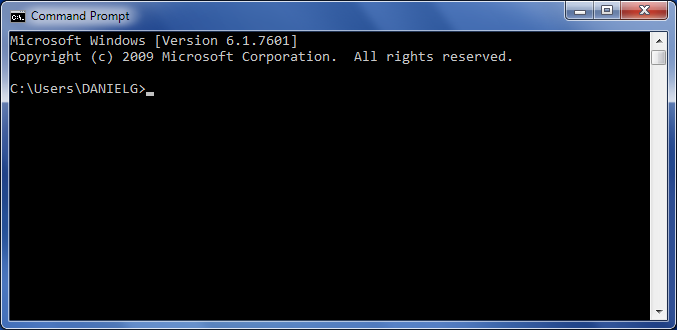
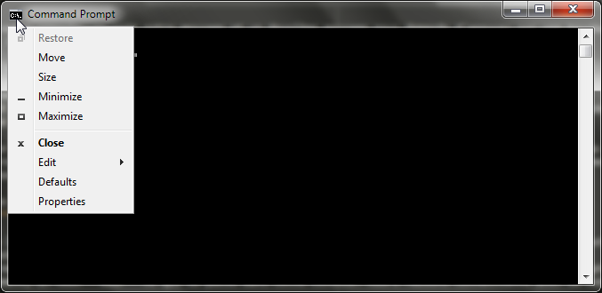
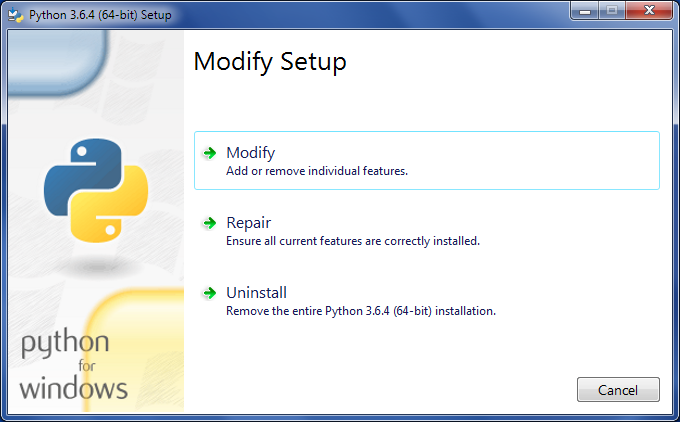
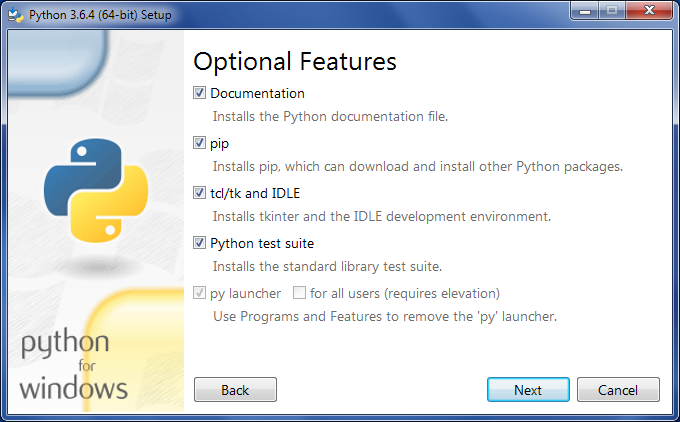
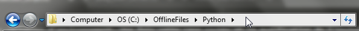

Exécuter ses scripts Python
===========================

Windows
-------

Lorsque Python est installé sous Windows, il est déroutant au début de trouver comment exécuter un script. Il existe bien entendu la possibilité d'utiliser **IDLE**. A l'installation, une option par défaut est d'associer les fichier \*.py avec le *Python Launcher*. Ceci a pour effet qu'en faisant un double clic sur le fichier \*.py, le script s'exécute.

L'exécution d'un script Python a pour effet d'ouvrir une console. C'est la fenêtre avec le fond noir.

    la console de commande

Le problème est que lorsque le script est terminé, Python n'ayant plus rien à faire se ferme aussi ce qui a pour conséquence de fermer la console de commande qui y était associée. Donc lorsqu'on découvre Python, on nous demande généralement de commencer en tapant ce code : 

.. code-block:: python
    :caption: premier_script.py

    print("Hello World!")

Mais un double clic sur notre fichier ``premier_script.py`` va ouvrir la console de commande et la refermer aussi vite, ne nous permettant pas de voir notre message. Malheureusement un bien mauvais conseil est alors fourni. On nous dit d'ajouter les lignes suivantes à notre programme :

.. code-block:: python
    :caption: premier_script.py

    import os
    print("Hello World!")
    os.system("pause")

Et en effet, en ouvrant notre console, on voit notre message et un deuxième message nous demande d'appuyer sur une touche pour continuer. Fantastique ! Sauf que ...

.. warning:: L'appel à ``os.system("pause")`` va exécuter un programme qui est normalement est interne à la console (``cmd.exe``). Cependant si un programme s'appelle ``pause.exe`` il sera appelé à la place de la commande interne. Ce programme pourrait être malicieux et exécuter du code qui aurait pour but de vous nuire. Cette pratique est fortement découragée, pas seulement pour les risques de sécurité, mais aussi pour la simple raison qu'elle donne une fausse idée de la manière dont un programme fonctionne.

On s'expose au risque décrit ci-dessus. De plus si on fait une erreur dans notre code et que Python lance une exception, la ligne contenant la pause ne sera pas exécutée et on revient au problème initial: la console de commande se referme toute seule, sans nous donner la possibilité de voir où se trouve le problème car le message d'erreur a disparu immédiatement.

Exécuter un script Python sous Windows : la bonne manière
^^^^^^^^^^^^^^^^^^^^^^^^^^^^^^^^^^^^^^^^^^^^^^^^^^^^^^^^^^

Au lieu de lutter contre le système d'exploitation, il serait préférable de l'utiliser de la manière adéquate. Si on veut exécuter un programme destiné à la console de commande, on ouvre une console de commande et on exécute le script. Pour l'utilisateur lambda de notre programme qui ne connaît rien à la programmation, il pourra double cliquer sur notre script. Mais durant le développement, on veut **voir** ce qui se passe dans cette console. Alors faisons connaissance avec la console de commande.

Comment ouvrir une console de commande ?
****************************************

La console de commande est un programme comme un autre qui se nomme ``cmd.exe``. Il faut donc cliquer sur le bouton Windows et en tapant les lettres :guilabel:`cmd`, Windows nous propose d'ouvrir la console de commande.

On est accueilli par une console au fond noir. On peut configurer quelques propriétés utiles. Pour ce faire, il faut cliquer sur l'icône au haut à gauche de la barre de titre de notre console.

    Ouvrir les propriétés de la console de commande

Dans le premier onglet *Options*, je conseille de sélectionner l'option **Mode d'édition rapide** qui permet de sélectionner le texte de la console avec sa souris, pratique pour faire des *copier-coller* des messages de sa console vers un autre programme. En cliquant et déplaçant la souris sur la console, on peut voir qu'une partie du texte se surligne. Pour copier le texte, Il ne faut **pas** appuyer sur :guilabel:`Ctrl-C` mais sur :guilabel:`Return` (la touche retour à la ligne). Le texte sera copier dans le *presse-papier* et peut être coller où on le veut avec un :guilabel:`Ctrl-V`, ou un clic droit et **coller**.

Comment lancer l'interpréteur Python ?
**************************************

Il faut d'abord s'assurer que le *Python launcher* est bien visible depuis la console. Il suffit simplement d'entrer la commande ``py``. Soit vous vous retrouvez dans l'interpréteur Python :

.. figure:: executer_script/launch_py.png
    :align: center
    :alt: Exécuter py.exe

    Ouvrir l'interpréteur Python depuis la console

.. note:: On quitte l'interpréteur Python en tapant ``exit()`` ou en appuyant sur :guilabel:`CTRL-Z`.

Ou alors vous obtenez un message d'erreur disant :

.. code-block:: doscon
    
    C:\Users\DANIELG>py
    'py' n'est pas reconnu en tant que commande interne
    ou externe, un programme exécutable ou un fichier de commandes.

Lorsqu'on entre la commande ``py`` dans la console, Windows tente de trouver un programme ``py.exe`` dans le répertoire courant (là où on se trouve). Comme il ne le trouve pas, il va voir dans d'autres répertoires fournit dans la variable d'environnement ``%PATH%``. Mais le dossier du *Python launcher* n'a pas été ajouté à la liste des répertoires dans lesquelles chercher.

Pour remédier au problème, il suffit de cliquer sur le bouton Windows, et de sélectionner **Ajouter ou supprimer des programmes**. Dans la liste des programmes, on sélectionne notre installation de Python et on clique sur le bouton **Modifier**. Une nouvelle fenêtre apparaît :

    Modifier l'installation de Python

Il faut choisir **Modifier**. Sur le prochain écran, il n'y a rien à changer.

Finalement c'est le dernier écran qui nous intéresse.

.. figure:: executer_script/advanced_features.png
    :align: center
    :alt: Options avancées

    Les options avancées

On veut ajouter Python aux variables d'environnement. Une fois cette case cochée et la modification de l'installation terminée, on doit fermer la console et ouvrir une nouvelle afin que les changements soient pris en compte. A présent la commande ``py`` est bien reconnue et on peut lancer l'interpréteur Python.

Comment exécuter un script Python ?
***********************************

A présent voyons comment exécuter notre script depuis la console. Il faut tout d'abord *naviguer* vers le dossier où se trouve notre script. La commande ``cd`` (**C**\ hange **D**\ irectory) permet de changer le répertoire dans lequel on se trouve. Mais où se trouve-t-on en fait ? Analysons un instant l'invite fournie par Windows. Dans mon cas c'est :

.. code-block:: doscon
    
    C:\Users\DANIELG>

La lettre ``C:`` est associée à mon disque dur principal, là où est installé Windows. C'est ce qu'on appelle la *racine* de mon disque. Le symbole ``\`` est le symbole séparateur de dossiers. Le tout premier symbole veut dire qu'on part de la racine, puis vient le dossier ``Users`` qui contient le dossier ``DANIELG``. C'est le **répertoire courant**. Pour se rendre dans le répertoire ``Desktop`` contenu dans le répertoire courant ``\Users\DANIELG``, on utilise la commande ``cd`` suivie du nom du dossier ``Desktop``. Comme les programmeurs sont des gros fainéants, on utilise l'*auto-completion*. On ne tape que quelques lettres du dossier et on appuie sur la touche de tabulation ``cd Des``:guilabel:`TAB`. Windows nous propose un nom de dossier qui commence par ces lettres. Si par malchance un autre dossier commençait par ces 3 lettres aussi, des appuis successifs sur :guilabel:`TAB` permettent de passer à la prochaine suggestion.

Si on désire se rendre dans le dossier parent, on utilise la commande ``cd ..``. Si on veut retourner à la racine, on utilise la commande ``cd \``. Il est possible de mettre immédiatement tout le chemin en une fois et en utilisant à chaque fois :guilabel:`TAB` pour nous éviter de tout taper. Donc si je dois me rendre dans le dossier ``C:\OfflineFiles\Python`` alors que je suis actuellement dans le dossier ``\Users\DANIELG``, je dois retourner depuis la racine et me rendre successivement dans ``OfflineFiles`` et ``Python``. En une seule commande, ça donne ``cd \OfflineFiles\Python``. Et bien entendu je n'ai tapé que ``of`` suivi de :guilabel:`TAB` puis ``\p`` suivi de :guilabel:`TAB` et Windows a complété le chemin pour moi :

.. code-block:: doscon
    
    C:\Users\DANIELG>cd \OfflineFiles\Python

    C:\OfflineFiles\Python>

Vous devez donc à présent vous rendre dans le dossier où se trouve votre script Python. Il est aussi possible d'ouvrir l'explorateur Windows, de vous rendre là où se trouve votre script Python et cliquer sur la barre de navigation.

En cliquant dessus, le chemin apparaît. Pour moi c'est ``C:\OfflineFiles\Python``. On peut copier ce texte avec :guilabel:`Ctrl-C` et le placer dans la console en tapant d'abord la commande ``cd`` suivie d'un espace puis un clic droit de la souris dans la console va coller le chemin.

Une fois dans le dossier où se trouve notre script, il ne nous reste plus qu'à l'exécuter en tapant :

.. code-block:: doscon
    
    C:\OfflineFiles\Python>py premier_script.py

On peut à présent voir en toute quiétude l'exécution de notre script ou ses messages d'erreurs. Notre console reste ouverte.