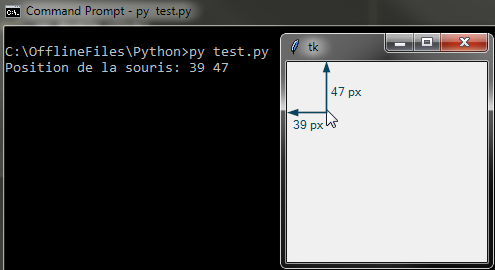
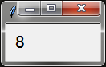

Programmation événementielle avec tkinter
=========================================

Programmer un GUI (*Graphic User Interface*) est différent de la programmation sous console. En effet pour un programme console, on affiche du texte avec des ``print`` et on attend l'entrée de l'utilisateur avec des ``input``. Le code *bloque* tant que l'utilisateur n'a pas enfoncé la touche :guilabel:`Entrée`.

Dans une application GUI, l'interface graphique qui comprend divers *widgets* (tels que boutons, menus, entrées de texte, ...) apparaît à l'utilisateur et le programme *attend* que l'utilisateur interagisse au travers d'une action. On appelle cette action un *événement*. Parmi les événements les plus communs, on peut citer :

* Un clic sur un bouton de la souris
* Le déplacement de la souris
* L'appui sur une touche du clavier
* Le relâchement d'une touche de clavier
* Un clic sur la croix de fermeture de la fenêtre principale
* Un compte à rebours (*timer*) est écoulé (cet événement n'est pas déclenché par l'utilisateur à proprement parler)

Mais comment tkinter fait-il pour *attendre* un événement ? Tout simplement avec une boucle infinie. tkinter ne sortira de cette boucle que lorsque l'utilisateur quittera le programme, le plus souvent en cliquant sur la croix de fermeture de la fenêtre. Voyons comment tout ça fonctionne.

Boucle événementielle
---------------------

Un exemple minimaliste pour un programme tkinter est le suivant : ::

    import tkinter as tk

    app = tk.Tk()
    app.mainloop()
    print("On quitte le programe.") # On teste quand on sort du mainloop

Après avoir créé une instance de ``Tk``, nous appelons la méthode ``mainloop``. On remarquera que tant que la fenêtre tkinter est affichée, la console ne montre pas encore le texte *On quitte le programe*. La raison est bien entendu que la méthode ``mainloop`` contient notre boucle infinie dont on ne sortira que lorsqu'on fermera la fenêtre. Ensuite on voit notre texte s'afficher dans la console.

Cette méthode ``mainloop`` est souvent source de confusion au début. On ne comprends pas trop où la placer, on veut en placer à divers endroits du code, et son fonctionnement reste souvent mystérieux. Pour utiliser un outil, il est impératif de le comprendre afin de raisonner correctement. Voyons ce que cache la *boucle principale* ``mainloop``. 

La boucle principale est donc une boucle infinie avec laquelle on ne peut interagir que de deux manières :

- En définissant une fonction (*callback*) que tkinter devra appeler lorsqu'un événement donné se produira. Exemple: lorsque la souris se déplace, appelle la fonction qui va afficher la position de la souris dans un ``Label``. On *lie* un callback à un événement avec la méthode bind_. On verra plus en détail son utilisation dans la prochaine section **Réagir à un événement**.

- En créant un compte à rebours (*timer*) qui exécutera une fonction après un temps donné. On nomme communément cette fonction un **callback**, qui signifie *rappel*. 

 Exemple: dans 30 secondes, appelle la fonction qui vérifie si j'ai un nouvel email. On crée un nouveau timer avec la méthode `after <http://effbot.org/tkinterbook/widget.htm\#Tkinter.Widget.after-method>`_. On verra aussi plus en détail cette méthode dans la section **Gérer le temps**.

Cette boucle événementielle pourrait se schématiser comme ceci : ::

    def mainloop(app):
        """Boucle événementielle schématisée (pseudo code) de tkinter"""
        continuer = True
        while continuer:
            # Appel des callbacks enregistrés avec *after* si le temps est écoulé
            # Pour chaque événement (clavier, souris, ...):
                #Si on a lié l'événement avec *bind*, on appelle le callback
            # Si on clique sur la croix pour fermer la fenêtre:
                continuer = False

A chaque tour de boucle, tkinter exécute ces opérations :

- Pour chaque événement détecté depuis le dernier tour de boucle (comme l'appui d'une touche de clavier, le déplacement de la souris, ...) tkinter exécute tout *callback* lié à cet événement.
- Si le temps qui s'est écoulé est supérieur au temps du compte à rebours, le *callback* est exécuté.

Les *Widgets* de tkinter utilisent aussi en interne la méthode bind_ pour produire les comportements attendus. Ainsi un widget ``Button`` va utiliser un événement de clic gauche de souris pour appeler son propre *callback* (fonction). Ce *callback* va déterminer si la position de la souris était sur le bouton et le cas échéant, va appeler la fonction fournie par l'utilisateur lors de la création du bouton.

Les deux prochaines sections vont illustrer comment lier une fonction à un événement et comment utiliser un timer.

Réagir à un événement
---------------------

Comme on vient de le voir, il est possible de *lier* une fonction à un événement grâce à la méthode bind_. Nous allons à présent voir un peu plus en détail comment utiliser cette méthode.

Format des événements
*********************

Le premier argument de la méthode ``bind`` est un événement. On le définit par une chaîne de caractères de la forme :

.. centered:: ``"<modificateur-type-détail>"``

L'élément le plus important est celui du milieu ``type``. C'est le type d'événement qui nous intéresse comme ``Button`` pour un clic de souris ou encore ``Key`` pour l'appui d'une touche du clavier. ``modificateur`` et ``détail`` permettent d'ajouter des informations supplémentaires sur le type d'événement qui nous intéresse. Par exemple la partie ``modificateur`` peut renseigner qu'on ne s'intéresse qu'à un *double-clic* (au lieu d'un simple clic) ou encore si c'est la combinaison des touches :guilabel:`Alt-X` qui est enfoncée (contrairement à la touche :guilabel:`X` seule). La partie ``détail`` nous permettra de renseigner si le clic de bouton doit être le droit ou le gauche par exemple.

Les parties ``modificateur`` et ``détail`` peuvent être omises. Pour l'appui d'une touche de clavier, on simplifie même encore plus les choses, puisqu'on ne renseigne que le nom de la touche qui nous intéresse avec ou sans les crochets ``"<>"``. Ainsi pour l'appui de la touche :guilabel:`X` on aura tout simplement la chaîne de caractères ``"x"``. Par contre si on veut la combinaison de touches :guilabel:`Alt-X` on écrira ``"<Alt-x>"`` entre crochets, puisqu'on renseigne un *modificateur*.

Les types d'événements pour débuter :

.. list-table::
    :widths: 18 30
    :header-rows: 1

    * - Type
      - Description
    * - ``Button`` 
      - Un clic de souris. La partie ``modificateur`` peut renseigner si c'est un clic gauche (1), un clic avec la molette (2) ou un clic droit(3)
    * - ``ButtonRelease``
      - Le bouton de la souris a été relâché
    * - ``KeyPress`` (ou ``Key`` plus simplement)
      - L'utilisateur a enfoncé une touche. C'est le type utilisé par défaut quand on ne renseigne que le nom d'une touche
    * - ``KeyRelease``
      - L'utilisateur a relâché une touche
    * - ``Enter``
      - L'utilisateur a déplacé la souris dans le Widget sur lequel on *lie* l'événement
    * - ``Leave``
      - L'utilisateur a déplacé la souris hors du Widget sur lequel on *lie* l'événement

Il existe une longue liste de types d'événements. Il est préférable de lire la documentation pour trouver votre bonheur. On peut trouver quelques exemples `ici <http://effbot.org/tkinterbook/tkinter-events-and-bindings.htm#events>`_. Sinon on aura un peu plus de détails avec ces différents liens :

- `types d'événements <http://infohost.nmt.edu/tcc/help/pubs/tkinter/web/event-types.html>`_
- `modificateurs <http://infohost.nmt.edu/tcc/help/pubs/tkinter/web/event-modifiers.html>`_
- Pour les ``détails``, voici la liste des `noms des touches spéciales <http://infohost.nmt.edu/tcc/help/pubs/tkinter/web/key-names.html>`_

Quelques exemples d'événements
^^^^^^^^^^^^^^^^^^^^^^^^^^^^^^

- ``"<KeyPress-s>"`` : Touche :guilabel:`S` enfoncée
- ``"<Return>"`` : Touche :guilabel:`Entrée` enfoncée. (Attention! C'est différent de ``"<Enter>"`` qui est un type d'événement)
- ``"<Button-1>"`` : Clic gauche de souris
- ``"<Double-Button-1>``" : Double clic gauche de souris
- ``"<Any-KeyPress>"`` : N'importe quelle touche est enfoncée

Le callback
***********

Le *callback* est la fonction qui sera appelée par tkinter lorsque l'événement se produit. Cette fonction doit accepter un argument, qui sera un objet *event*. Donc sa signature devra être quelque chose comme : ::

    def mon_callback(event):
        pass

L'objet *event* permet à tkinter de nous donner des informations sur l'événement qui a été déclenché dans différents *attributs*. On accède à ces attributs comme pour n'importe quel objet, avec la notation ``event.nom_attribut``. Voici les différents attributs disponibles :

- ``widget`` : c'est l'instance du widget qui a déclenché cet événement.
- ``x``, ``y`` : la position de la souris par rapport à la fenêtre
- ``x_root``, ``y_root`` : la position de la souris par rapport à l'écran
- ``char`` : le caractère (seulement pour un événement clavier) sous forme de chaîne de caractères
- ``keysym`` : la *représentation* du caractère (seulement pour un événement clavier)
- ``keycode`` : un code unique pour une touche du clavier
- ``num`` : le numéro du bouton (seulement pour un événement souris). 1 pour bouton gauche, 2 pour molette et 3 pour bouton droit.
- ``width``, ``height`` : la nouvelle largeur et hauteur du widget (seulement pour un événement ``Configure``)
- ``type`` : le type de l'événement, représenté par un nombre. `Tableau de correspondance entre le numéro et le type d'événement <http://infohost.nmt.edu/tcc/help/pubs/tkinter/web/event-types.html>`_

Comme on le voit, certains types d'événements ajoutent des informations supplémentaires. La différence entre ``keysym`` et ``char`` se voit seulement avec les touches *spéciales* comme par exemple :guilabel:`F4`. En appuyant sur cette touche, ``char`` vaut ``""`` alors que ``keysym`` vaut ``"F4"``.

Mise en pratique
****************

Afin de voir en action comment tout ça fonctionne, on va écrire un simple programme qui va nous indiquer où se trouve la souris lorsqu'on fait un double clic gauche. Il nous faudra donc réagir à l'événement ``"<Double-Button-1>"``, lire les attributs ``x`` et ``y`` de l'objet ``event`` et afficher le résultat dans la console : ::

    import tkinter as tk

    def on_double_click(event):
        print("Position de la souris:", event.x, event.y)

    app = tk.Tk()
    app.bind("<Double-Button-1>", on_double_click)
    app.mainloop()

    Position de la souris sur un double clic

Gérer le temps
--------------

Parfois on veut écrire un code qui ne s'exécutera qu'après un délai. L'erreur classique est d'utiliser des fonctions comme ``sleep`` qui suspendent l'exécution de notre programme pendant un temps donné. Avec notre *boucle principale*, on ne peut pas suspendre le programme, sans quoi tkinter ne gèrerait plus les événements et aux yeux de l'utilisateur, l'application aurait l'air bloquée (*frozen*). En effet, si l'utilisateur cliquait avec sa souris sur un Widget, il n'y aurait plus aucune réaction visible.

Afin de résoudre ce problème, tkinter offre la méthode de widgets ``after(delay, function, *args, **kwargs)`` qui met dans une *file d'attente* la fonction renseignée. Une fois que le temps ``delay`` exprimé en millisecondes est écoulé, tkinter exécutera la fonction ``function`` en lui passant les arguments ``args``  et ``kwargs`` fournis.

Prenons un exemple tout simple. On veut faire une petite application avec un compteur qui s'incrémente à chaque seconde. Il nous suffit donc de créer un ``Label`` qui contiendra le texte qu'on veut montrer (le compteur), et une fonction qu'on va appeler toutes les secondes pour incrémenter notre valeur de 1 :

.. code-block:: python
    :emphasize-lines: 5

    import tkinter as tk

    def incremente():
        "Incrémente le compteur à chaque seconde"
        global compteur
        compteur += 1
        compteur_lbl['text'] = str(compteur)

    app = tk.Tk()
    compteur = 0
    compteur_lbl = tk.Label(app, text=str(compteur), font=("", 16))
    compteur_lbl.grid(padx=8, pady=8)

    app.after(1000, incremente)
    app.mainloop()

.. attention::
    J'ai utilisé le mot clé ``global`` afin de changer la valeur de ``compteur``. Il y a une manière beaucoup plus propre d'arriver à ce résultat en utilisant un objet ``IntVar``. Ceci sera couvert dans une future partie du tutoriel.

On observe que la valeur du ``Label`` passe de 0 à 1 en 1 seconde, mais ensuite plus rien ne se passe. Pourquoi ?

La raison est que ``after`` place notre fonction dans la file d'attente. Après 1 seconde, tkinter exécute la fonction et **enlève la fonction de la file d'attente**. Afin d'exécuter la fonction de manière répétitive, il faut qu'ensuite la fonction elle-même se remette dans la file d'attente en utilisant ... la méthode ``after``. Ce qui donne ce code modifié : ::

    import tkinter as tk

    def incremente():
        "Incrémente le compteur à chaque seconde"
        global compteur
        compteur += 1
        compteur_lbl['text'] = str(compteur)
        app.after(1000, incremente)

    app = tk.Tk()
    compteur = 0
    compteur_lbl = tk.Label(app, text=str(compteur), font=("", 16))
    compteur_lbl.grid(padx=8, pady=8)

    app.after(1000, incremente)
    app.mainloop()

    Chrono en tkinter

A présent le compteur s'incrémente indéfiniment. Si on ne voulait incrémenter le compteur que 10 fois par exemple, on aurait pu ajouter en fin de fonction ``incremente`` une condition sur la valeur de ``compteur``. Si elle est plus petite que 10, on exécute la ligne ``app.after(1000, incremente)``. Sinon on ne fait rien, et la fonction ne sera plus dans la file d'attente.

Ajoutons une deuxième action répétitive à notre programme. On ne va rien faire de très compliqué. On va juste ajouter un autre compteur mais qui va un peu plus vite que le premier. Il s'incrémentera de 1 toutes les 0.8 secondes : ::

    import tkinter as tk

    def incremente():
        "Incrémente le compteur à chaque seconde"
        global compteur
        compteur += 1
        compteur_lbl['text'] = str(compteur)
        app.after(1000, incremente)

    def incremente_rapide():
        "Incrémente le compteur toutes les 0.8 secondes"
        global compteur_rapide
        compteur_rapide += 1
        compteur_rapide_lbl['text'] = str(compteur_rapide)
        app.after(800, incremente_rapide)

    app = tk.Tk()
    compteur = 0
    compteur_rapide = 0
    compteur_lbl = tk.Label(app, text=str(compteur), font=("", 16))
    compteur_lbl.grid(padx=8, pady=8)
    compteur_rapide_lbl = tk.Label(app, text=str(compteur_rapide), font=("", 16))
    compteur_rapide_lbl.grid(padx=8, pady=8)

    app.after(1000, incremente)
    app.after(800, incremente_rapide)
    app.mainloop()

Les deux compteurs s'incrémentent chacun à leur rythme. Il est important de réaliser que la *boucle principale* n'arrête pas de *tourner* en attendant un événement ou que le délai de la fonction dans la liste d'attente soit écoulé. C'est parce que cette boucle tourne continuellement qu'elle donne l'illusion que des actions se produisent simultanément. On a l'impression que chaque compteur est un programme indépendant. Hors il ne s'agit pas de *Threads* ou autres mécanismes de concurrence. Il s'agit simplement d'une boucle qui tourne rapidement et qui tantôt exécute le code ``incremente`` et tantôt le code de ``incremente_rapide``.

Il est à présent plus clair pourquoi l'une de ces fonctions ne peut pas contenir de fonction ``sleep``. Si c'était le cas, le programme s'arrêterait et tkinter n'aurait plus l'opportunité de continuer sa boucle principale. Il n'aurait donc plus l'occasion d'observer le temps qui s'écoule et ne pourrait plus exécuter les éventuelles fonctions placées dans la file d'attente grâce à ``after``.

Raisonner avec une boucle événementielle
----------------------------------------

Pour bien comprendre les challenges qu'induisent une boucle événementielle, prenons un exemple. Imaginons qu'on veuille écrire un petit jeu **devine le nombre auquel je pense**.

Dans un programme console, ce jeu simplisme pourrait s'écrire ainsi : ::

    from random import randint

    print("Devine le nombre auquel je pense.")
    nombre_secret = randint(0, 100) + 1

    gagne = False
    while not gagne:
        reponse = int(input("Choisi un nombre entre 1 et 100 inclus: "))
        if nombre_secret > reponse:
            print("Le nombre est plus grand")
        elif nombre_secret < reponse:
            print("Le nombre est plus petit")
        else:
            gagne = True

    print("Tu as trouvé le nombre. Bravo!")

Il n'y a pas de gestion des mauvaises entrées faites par l'utilisateur. Pour l'exemple ce n'est pas important car ça alourdirait le code.

Si on veut transposer ce jeu à tkinter, on voit tout de suite plusieurs
*différences* :

-   Pour afficher un message, on doit utiliser un Widget de tkinter.     Probablement qu'un `Label <http://effbot.org/tkinterbook/label.htm>`_     fera l'affaire.
-   Pour demander une entrée à l'utilisateur, on doit aussi utiliser un     Widget. Un `Entry <http://effbot.org/tkinterbook/entry.htm>`_ fera aussi l'affaire.
-   Mais comment savoir quand l'utilisateur a fini d'entrer son nombre ? On pourrait ajouter un bouton *Valider* à côté du Widget ``Entry``, ou alors on pourrait *lier* l'événement <appui de la touche :guilabel:`Entrée`> avec la fonction qui validerait l'entrée de l'utilisateur.
-   Les messages *"Le nombre est plus grand"*, *"Le nombre est plus petit"* et *"Tu as trouvé le nombre. Bravo!"* devraient apparaître dans un autre ``Label``.

Mais comment coordonner tout ça ? On va d'abord mettre en place les
éléments que l'utilisateur voit au début du jeu : ::

    from random import randint
    import tkinter as tk

    app = tk.Tk()
    titre = tk.Label(app, text="Devine le nombre auquel je pense", font=("", 16))
    titre.grid(row=0, columnspan=2, pady=8)

    nombre_secret = randint(0, 100) + 1

    lbl_reponse = tk.Label(app, text="Choisi un nombre entre 1 et 100 inclus:")
    lbl_reponse.grid(row=1, column=0, pady=5, padx=5)

    reponse = tk.Entry(app)
    reponse.grid(row=1, column=1, pady=5, padx=5)

    app.mainloop()

.. figure :: prog_even_tkinter/devine.png
    :align: center
    :alt: devine le nombre

    Devine le nombre auquel je pense

La dernière ligne nous fait entrer dans la boucle événementielle. Mais comme on n'a rien lié comme événement, il ne se passera rien. En gros, on va rester sur cette interface jusqu'à ce que l'utilisateur ferme la fenêtre. On doit maintenant décider de l'élément déclencheur qui nous permettra de poursuivre l'exécution de notre code. Cet élément est l'appui de la touche :guilabel:`Entrée`. Comme dit plus haut, ça aurait pu être l'appui sur un bouton *Valider*. Mais nous choisissons dans cette version de réagir à la touche :guilabel:`Entrée`.

Pour ce faire il suffit d'ajouter en ligne 15 cette ligne de code ::

    reponse.bind("<Return>", nombre_choisi)

.. tip::
    Ce serait un bon exercice d'ajouter un bouton à droite du *Entry* et en cas de clic, on appellerait aussi la fonction ``nombre_choisi``.

On lie donc l'appui de la touche :guilabel:`Entrée` à l'exécution d'une fonction ``nombre_choisi`` que nous n'avons pas encore définie. Dans cette fonction, on pourra comparer le nombre entré par l'utilisateur au nombre secret et ajouter un ``Label`` avec le message adéquat. ::

    def nombre_choisi(event):
        "Callback quand le joueur a entré un nombre."
        nbre_choisi = int(reponse.get())
        if nombre_secret > nbre_choisi:
            # Faut-il créer un nouveau Label ici ??
        elif nombre_secret < nbre_choisi:
            # Même question
        else:
            # Gagné. Nouveau Label?? Et puis on fait quoi??

Mais comme l'indiquent les commentaires du code, si on créé un nouveau ``Label``, à chaque exécution de la fonction ``nombre_choisi``, un nouveau ``Label`` viendra se placer sur le précédent. Au final on aura une pile de Label inutile, car seul le dernier Label sera visible. Ce n'est pas ce que l'on veut. On veut pouvoir afficher ce message, et le remplacer par un nouveau message lorsque nécessaire. Autrement dit on veut juste *changer* le texte du *Label*. Il nous faut donc un ``Label`` créé dès le départ mais ne contenant rien comme texte. Dans la fonction ``nombre_choisi`` on pourra juste changer le texte du Label pour afficher ce que l'on souhaite. On peut placer ce texte où bon nous semble. Je choisis de le mettre juste en dessous du ``Entry``. Le code devient alors : ::

    def nombre_choisi(event):
        "Callback quand le joueur a entré un nombre."
        nbre_choisi = int(reponse.get())
        if nombre_secret > nbre_choisi:
            resultat["text"] = "Le nombre est plus grand"
        elif nombre_secret < nbre_choisi:
            resultat["text"] = "Le nombre est plus petit"
        else:
            resultat["text"] = "Tu as trouvé le nombre. Bravo!"

A ajouter dans le corps du script ::

    resultat = tk.Label(app, text="")
    resultat.grid(row=2, column=1, pady=5, padx=5)

.. note::
    Changer le texte d'un Label revient à changer une de ses *options*. Je vous recommande de lire dans la documentation les différencesentes manières de lire et écrire les options d'un Widget: http://effbot.org/tkinterbook/tkinter-widget-configuration.htm

    J'utilise ici la méthode ``widget["option"] = value``. Plus loin j'utiliserai ``widget.config(opt1=val1, opt2=val2, ...)`` lorsque je devrai configurer plus d'une option à la fois.

Ce n'est pas encore parfait, mais on a un début de programme utilisable. Il reste quelques *problèmes*. Le premier est que lorsqu'on a trouvé le bon nombre, le programme continue à nous demander un nouveau nombre. Et c'est normal, puisqu'il n'y a rien décrivant ce qu'il faut faire en cas de victoire, hormis afficher un message.

Pour résoudre ce problème, il faudrait déjà décider de ce qu'il doit se passer lorsque le nombre secret est découvert. Si on quitte directement le programme, le joueur n'aura pas le temps de lire le message de victoire et ne comprendra pas pourquoi la fenêtre s'est fermée. Si on laisse le ``Entry``, le joueur pourra continuer à entrer de nouveaux nombres, et en appuyant sur :guilabel:`Entrée`, la fonction ``nombre_choisi`` continuera a être appelée.

L'idéal serait d'*enlever* les éléments qui ne nous sont plus nécessaires et de laisser un Label avec le message de victoire. L'utilisateur n'aura d'autres choix que de fermer lui-même la fenêtre après avoir lu le message. Pour accomplir cette tâche, on peut *détruire* les Widgets inutiles, et replacer notre ``resultat`` en dessous du titre. Il servira à afficher notre message de victoire : ::

    def nombre_choisi(event):
        "Callback quand le joueur a entré un nombre."
        nbre_choisi = int(reponse.get())
        if nombre_secret > nbre_choisi:
            resultat["text"] = "Le nombre est plus grand"
        elif nombre_secret < nbre_choisi:
            resultat["text"] = "Le nombre est plus petit"
        else:
            # On enlève les éléments dont on n'a plus besoin
            lbl_reponse.destroy()
            reponse.destroy()
            # On replace le Label `resultat` dans la ligne en dessous du titre
            resultat.grid_forget()
            resultat.grid(row=1, columnspan=2)
            # On configure le label avec le texte voulu, dans la font voulue et
            # dans la couleur désirée.
            resultat.config(text="Tu as trouvé le nombre. Bravo!",
                            font=("", 12),
                            fg="green")

Un deuxième *problème* est que l'utilisateur doit effacer le nombre qu'il a fourni en entrée avant de faire une autre proposition. Une solution serait d'écrire le nombre qu'il a choisi dans un ``Label`` et d'effacer le contenu du ``Entry``. Tout comme pour le *Label* ``resultat``, on va se créer un *Label* vide qu'on remplira une fois que le joueur aura fait une proposition. On veillera aussi à garder la proposition en cas de victoire. Le code finale donne ainsi : ::

    from random import randint
    import tkinter as tk

    def nombre_choisi(event):
        "Callback quand le joueur a entré un nombre."
        nbre_choisi = int(reponse.get())
        reponse.delete(0, tk.END)
        proposition["text"] = nbre_choisi
        if nombre_secret > nbre_choisi:
            resultat["text"] = "Le nombre est plus grand"
        elif nombre_secret < nbre_choisi:
            resultat["text"] = "Le nombre est plus petit"
        else:
            # On enlève les éléments dont on n'a plus besoin
            lbl_reponse.destroy()
            reponse.destroy()
            # On replace les Labels `proposition` et `resultat` dans la ligne 
            # en dessous du titre
            proposition.grid_forget()
            proposition.grid(row=1, column=0)
            resultat.grid_forget()
            resultat.grid(row=1, column=1)
            # On configure le label avec le texte voulu, dans la font voulue et
            # dans la couleur désirée.
            resultat.config(text="Tu as trouvé le nombre. Bravo!",
                            font=("", 12),
                            fg="green")

    app = tk.Tk()
    titre = tk.Label(app, text="Devine le nombre auquel je pense", font=("", 16))
    titre.grid(row=0, columnspan=2, pady=8)

    nombre_secret = randint(0, 100) + 1

    lbl_reponse = tk.Label(app, text="Choisi un nombre entre 1 et 100 inclus:")
    lbl_reponse.grid(row=1, column=0, pady=5, padx=5)

    reponse = tk.Entry(app)
    reponse.grid(row=1, column=1, pady=5, padx=5)
    reponse.bind("<Return>", nombre_choisi)

    proposition = tk.Label(app, text="")
    proposition.grid(row=2, column=0, pady=5, padx=5)

    resultat = tk.Label(app, text="")
    resultat.grid(row=2, column=1, pady=5, padx=5)

    app.mainloop()

Conclusion
----------

Nous avons à présent vu les principales différences entre la structure d'un programme séquentiel et événementiel. Si vous parvenez à garder à l'esprit qu'il y a une boucle principale qui tourne et que tout ce que vous pouvez faire pour interagir avec votre programme c'est de répondre à des événements ou utiliser des compte à rebours, vous pourrez produire des programmes cohérents utilisant des interfaces graphiques, rendant le programme plus conviviale pour l'utilisateur.

La programmation orienté objet (POO) pourra aider également à mieux structurer le code.

.. _bind: http://effbot.org/tkinterbook/widget.htm\#Tkinter.Widget.bind-method